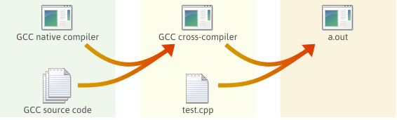
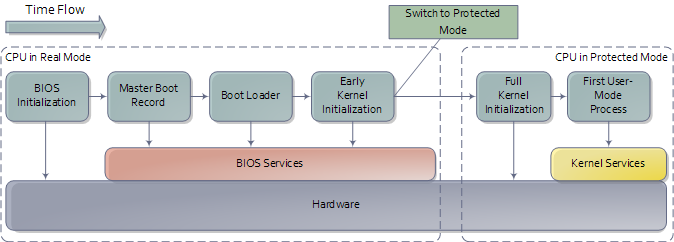

|

Introduction
=======================

Developing OS is complex task that requires very specific development environment and 
set of tools. Theoretically one could write an OS in any language he wants, however assembly, 
C and C++ are de facto languages for this kind of job.

Our compiler suite of choice is GCC, build system cmake, and scripting language Bash. 
Everything is build and assembled inside virtual machine built by vagrant. Vagrant 
enables us to automate complete complex process of building cross compiler, OS, linking 
and producing iso (even building documentation) into a single ``vagrant up`` command.

All development and examples were ran on Debian 9. Feel free to work from vagrant machine 
if you don't want to bother with setting up everything on your own host OS.

|

Development environment
=======================
Since we will be building and installing a lot of tools frequently many things could go wrong.
To make our life easier we can use virtual machines, and to make everything even more hassle free,
we can utilize virtual machine manager, such as vagrant. 

Preparing the box
~~~~~~~~~~~~~~~~~~~
Installing virtualbox and vagrant on Debian 9 is rather straightforward:

.. code:: bash

    # add stretch-backports main and contrib to your apt sources
    sudo apt install virtualbox
    wget https://releases.hashicorp.com/vagrant/2.1.1/vagrant_2.1.1_x86_64.deb
    sudo dpkg -i vagrant_2.1.1_x86_64.deb

Once we have the software we can write small vagrant script:

.. code:: ruby

  # -*- mode: ruby -*-
  # vi: set ft=ruby :
  Vagrant.configure("2") do |config|
    config.vm.box = "generic/debian9"
    config.vm.box_check_update = false
    config.vm.synced_folder ".", "/home/src"
    config.vm.provision :shell, path: "bootstrap.sh"
  end

Save it as Vagrantfile in the root of the project. This particular vagrant file downloads
Debian 9 image, mounts its root directory under ``/home/src`` in the virtual machine and
executes ``bootstrap.sh``. Shell script then invokes ``i686-elf-tools.sh`` script that 
downloads necessary sources and compiles cross compiler. Once the compiler is built 
bootstrap script invokes cmake that builds the OS itself, bootable iso and 
documentation.

Finally, starting whole building process is as simple as executing ``vargant up`` in the 
projects root directory.

Cross Compiler
~~~~~~~~~~~~~~
An cross-compiler is a compiler that runs on platform A (the host), but generates executables for platform B (the target). 
These two platforms may (but do not need to) differ in CPU, operating system, and/or executable format. In our case, 
the host platform is our current operating system, and the target platform is the operating system we are building.

GCC is great open source compiler and we will use it as cross compiler for our OS. The GNU Compiler Collection is an advanced piece of software with many dependencies. We will also need Binutils which are collection of binary tools, since we are also interested in linker and assembler.

Cross compiler building process is rather complex and lengthy process. See i686-elf-tools.sh for details.

First steps
~~~~~~~~~~~~~~~~~~~~~~~~~~~~~~~~~~~~~~~~~~~~~~~~~~

Small assembly code to demonstrate building bootable iso image.

.. code-block:: nasm

    global loader                   ; the entry symbol for ELF

    MAGIC_NUMBER equ 0x1BADB002     ; define the magic number constant
    FLAGS        equ 0x0            ; multiboot flags
    CHECKSUM     equ -MAGIC_NUMBER  ; calculate the checksum
                                    ; (magic number + checksum + flags should equal 0)

    section .text:                  ; start of the text (code) section
    align 4                         ; the code must be 4 byte aligned
        dd MAGIC_NUMBER             ; write the magic number to the machine code,
        dd FLAGS                    ; the flags,
        dd CHECKSUM                 ; and the checksum

    loader:                         ; the loader label (defined as entry point in linker script)
        mov eax, 0xCAFEBABE         ; place the number 0xCAFEBABE in the register eax
    .loop:
        jmp .loop                   ; loop forever

The file loader.s can be compiled into a 32 bits ELF [18] object file with the following command:

.. code-block:: bash

    nasm -f elf32 loader.s

The code must now be linked to produce an executable file, which requires some extra thought 
compared to when linking most programs. We want GRUB to load the kernel at a memory address 
larger than or equal to 0x00100000 (1 megabyte (MB)), because addresses lower than 1 MB are 
used by GRUB itself, BIOS and memory-mapped I/O. Therefore, the following linker script is 
needed (written for GNU LD):

.. code::

  ENTRY(loader)                /* the name of the entry label */
  
  SECTIONS {
      . = 0x00100000;          /* the code should be loaded at 1 MB */
  
      .text ALIGN (0x1000) :   /* align at 4 KB */
      {
          *(.text)             /* all text sections from all files */
      }
  
      .rodata ALIGN (0x1000) : /* align at 4 KB */
      {
          *(.rodata*)          /* all read-only data sections from all files */
      }
  
      .data ALIGN (0x1000) :   /* align at 4 KB */
      {
          *(.data)             /* all data sections from all files */
      }
  
      .bss ALIGN (0x1000) :    /* align at 4 KB */
      {
          *(COMMON)            /* all COMMON sections from all files */
          *(.bss)              /* all bss sections from all files */
      }
  }

Save the linker script into a file called link.ld. The executable can now be linked with 
the following command:

.. code-block:: bash

    ld -T link.ld -melf_i386 loader.o -o kernel.elf

If you have GRUB installed, you can check whether a file has a valid Multiboot version 1 header, 
which is the case for our kernel. It's important that the Multiboot header is within the first 
8 KiB of the actual program file at 4 byte alignment. This can potentially break later if you 
make a mistake in the boot assembly, the linker script, or anything else that might go wrong. 
If the header isn't valid, GRUB will give an error that it can't find a Multiboot header when 
you try to boot it. This code fragment will help you diagnose such cases: 

.. code:: bash

  grub-file --is-x86-multiboot kernel.elf

Grub-file is quiet but will exit 0 (successfully) if it is a valid multiboot kernel and exit 1
(unsuccessfully) otherwise. You can type ``echo $?`` in your shell immediately afterwards to see 
the exit status. 

Building ISO 
~~~~~~~~~~~~
We will create the kernel ISO image with the program genisoimage. A folder must first be created that contains the files that will be on the ISO image. The following commands create the folder and copy the files to their correct places:

.. code:: bash

    mkdir -p iso/boot/grub              # create the folder structure
    cp stage2_eltorito iso/boot/grub/   # copy the bootloader
    cp kernel.elf iso/boot/             # copy the kernel

A `configuration file <https://www.gnu.org/software/grub/manual/legacy/Configuration.html#Configuration>`_ menu.lst for GRUB must be created. This file tells GRUB where the kernel is located and configures some options:

.. code::

    default=0
    timeout=0

    title os
    kernel /boot/kernel.elf

Place the file menu.lst in the folder iso/boot/grub/. The contents of the iso folder should now look like the following figure:

.. code::

    iso
    |-- boot
      |-- grub
      | |-- menu.lst
      | |-- stage2_eltorito
      |-- kernel.elf

Finally, make a ISO9660 image file like this: 

.. code:: bash

    genisoimage -R                              \
                -b boot/grub/stage2_eltorito    \
                -no-emul-boot                   \
                -boot-load-size 4               \
                -A os                           \
                -input-charset utf8             \
                -quiet                          \
                -boot-info-table                \
                -o os.iso                       \
                iso

For more information about the flags used in the command, see the manual for genisoimage.
This produces a file named os.iso, which then can be burned into a CD (or a DVD) or loaded directly into virtual machine.
The ISO image contains the kernel executable, the GRUB bootloader and the configuration file.

To run the OS in QEMU emulator execute:

.. code:: bash

    qemu-system-i386 -cdrom os.iso 

|
|

KaT OS Source Code
==================

::

  src
  |-bin
  |-docs
  |-libs
  |-kernel
  |  |-devices
  |  |-filesys
  |  |-sys
  |-userland

Bin contains built ISO image, docs documentation,
libs contains libc and libcpp, userland contains
user space aplications.

Kernel directory in its root has main.cpp which
is os entry point. Devices contain cpu, display,
input and storage drivers. Sys contains memory,
process and system drives, including cpp runtime.

Src directory aditionaly contains make file, menu
file for grub legacy, stage2_eltorito...

|
|

Basics
=======================
x86 is a family of backward-compatible instruction set architectures based on the Intel 8086 CPU and its Intel 8088 variant. The 8086 was introduced in 1978 as a fully 16-bit extension of Intel's 8-bit-based 8080 microprocessor, with memory segmentation as a solution for addressing more memory than can be covered by a plain 16-bit address. The term "x86" came into being because the names of several successors to Intel's 8086 processor end in "86", including the 80186, 80286, 80386 and 80486 processors. [1]

Booting
~~~~~~~~~~~~~~~~~

When you turn on a computer, it loads the BIOS from some special flash 
memory. The BIOS runs self test and initialization routines of the hardware, 
then it looks for bootable devices. If it finds one, the control is 
transferred to its bootloader, which is a small portion of executable 
code stored at the device's beginning. The bootloader has to determine 
the location of the kernel image on the device and load it into memory. 
It also needs to switch the CPU to the so-called protected mode because 
x86 CPUs start in the very limited real mode by default (to be backwards 
compatible)).

We won't write a bootloader because that would be a complex project on its 
own. Fortunately there is a bootloader standard: the Multiboot Specification. 
Our kernel just needs to indicate that it supports Multiboot and every 
Multiboot-compliant bootloader can boot it. We will use the Multiboot 2 
specification  together with the well-known GRUB 2 bootloader.

To indicate our Multiboot 2 support to the bootloader, our kernel must start 
with a Multiboot Header, which has the following format:

+----------------+------------------+-----------------------------------------+
|     Field      |      Type        |                  Value                  |
+----------------+------------------+-----------------------------------------+
| magic number   | u32              | 0xE85250D6                              |
+----------------+------------------+-----------------------------------------+
| architecture   | u32              | 0 for i386, 4 for MIPS                  |
+----------------+------------------+-----------------------------------------+
| header length  | u32              | total header size, including tags       |
+----------------+------------------+-----------------------------------------+
| checksum       | u32              | -(magic + architecture + header_length) |
+----------------+------------------+-----------------------------------------+
| tags           | variable         |                                         |
+----------------+------------------+-----------------------------------------+
| end tag        | (u16, u16, u32)  | (0, 0, 8)                               |
+----------------+------------------+-----------------------------------------+

Interrupts
~~~~~~~~~~~~~~~~~~~~~~~~~~~~~~~~~~
Write me.

Input and output
~~~~~~~~~~~~~~~~~~~~~~~~~~~~~~~~~~
Write me.

keyboard driver
----------------
write me.

Memory management
~~~~~~~~~~~~~~~~~~~~~~~~~~~~~~~~~~
Write me.

Processes
~~~~~~~~~~~~~~~~~~~~~~~~~~~~~~~~~~
Write me.

File system
~~~~~~~~~~~~~~~~~~~~~~~~~~~~~~~~~~
The purpose of file system is to organise and store data. File system
typically supports sharing data among users and applications, as well as
persistence so data is still available after reboot.

KaT OS implements ISO 9660 file system and ATAPI drivers.

ISO 9660
----------------
ISO 9660 is the standard file system for CD-ROMs. It is also widely used 
on DVD and BD media and may as well be present on USB sticks or hard disks. 
Its specifications are available for free under the name ECMA-119. 

An ISO 9660 sector is normally 2 KiB long. Although the specification allows 
for alternative sector sizes, you will rarely find anything other than 2 KiB. 
ISO 9660 file systems can have up to 2 exp 32 blocks, i.e. 8 TiB.

The following is the rough overall structure of the ISO 9660 file system:

+--------------------------------------------------------------+
|              ISO 9660 File System                            |
+=========================+====================================+
| System Area             | Unused by ISO 9660                 |
+-------------------------+------------------------------------+
| Data Area               | Volume Descriptor Set              | 
|                         |                                    |
|                         | Path tables, Directories and Files | 
+-------------------------+------------------------------------+

The ISO 9660 standard specifies three ways to encode 16 and 32-bit integers, 
using either little-endian (least-significant byte first), big-endian 
(most-significant byte first), or a combination of both (little-endian followed
by big-endian). Both-endian (LSB-MSB) fields are therefore twice as wide. 
For this reason, 32-bit LBA's often appear as 8 byte fields. Where a both-endian 
format is present, the x86 architecture makes use of the first little-endian 
sequence and ignores the big-endian sequence. 

References
=======================

Books:

1. xv6 book 10th ed, R. Cox, F. Kaashoek, R. Morris
2. The little book about OS development, E. Helin, A. Renberg
3. Operating systems: from 0 to 1, T.D. Hoang
4. Writing a Simple Operating System, N. Blundell
5. Operating System Concepts 10th ed., A. Silberschatz, G. Gagne, P.B. Galvin
6. Operating systems design and implementation 3rd ed, A. Tanenbaum
7. The Design of the UNIX Operating System, M.J. Bach
8. The Design and Implementation of the FreeBSD Operating System
9. Intel® 64 and IA-32 Architectures Software Developer’s Manual (Vol 3)

Internet pages:

1. https://en.wikipedia.org/wiki/X86
2. https://www.gnu.org/software/grub/manual/legacy
3. https://linux.die.net/man/1/qemu-img
4. https://wiki.osdev.org/C%2B%2B
5. https://wiki.osdev.org/Boot_Sequence
6. https://manybutfinite.com/post/how-computers-boot-up/
7. https://wiki.osdev.org/GCC_Cross-Compiler
8. https://en.wikipedia.org/wiki/Booting#BOOT-LOADER
9. https://en.wikipedia.org/wiki/GNU_GRUB
10. http://www.brokenthorn.com/Resources/OSDev12.html
11. http://www.brokenthorn.com/Resources/OSDev10.html
12. https://en.wikipedia.org/wiki/File_system

|
|